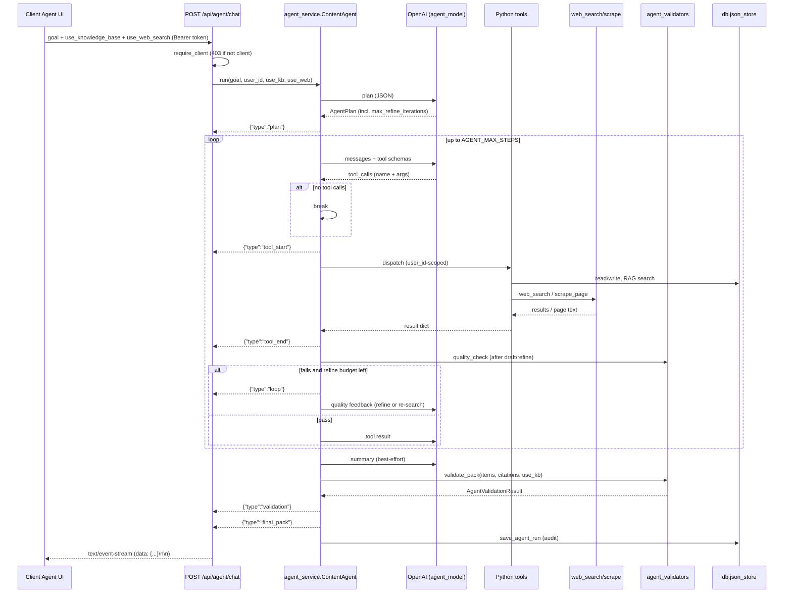

# Client Content Agent — Architecture

The PakVoice AI client content agent turns a free-text goal into a planned,
written, quality-checked `CampaignPack`. It is available **only** to
`role == "client"` accounts.

> Explicitly out of scope: any cost / token / spend telemetry.

---

## 1. Responsibility split

The LLM is the **writer and planner**. Everything else is deterministic
orchestration performed by the system — retrieval, validation, persistence, and
auth scoping are never left to the model.

| Concern | Who does it | Where |
| --- | --- | --- |
| Turn goal into a plan (goals/tools/constraints) | LLM | `agent_service._make_plan` |
| Decide which tools to call, in what order | LLM | OpenAI tool-calling loop |
| Write marketing copy | LLM | `ai_service.generate_content` |
| Refine copy | LLM | `ai_service.refine_content` |
| Suggest hashtags (bonus tags) | LLM | `agent_service._llm_hashtags` |
| Produce content variants | LLM | `agent_service._llm_variants` |
| Summarize the final pack | LLM | `agent_service._summarize` |
| Retrieve KB chunks / citations | system (deterministic) | `rag_service.search` |
| Search live web / scrape pages | system (deterministic) | `services.web_search` |
| Length / language / sensitivity / citation / cultural checks | system (deterministic) | `agent_validators` |
| Hashtag lexicon merge (static PK tags) | system (deterministic) | `agent_validators.merge_hashtags` |
| Calendar day scheduling | system (deterministic) | `agent_service._tool_plan_calendar` |
| Profile / KB / history reads, run audit write | system (deterministic) | `db.json_store` |
| Enforce client-only access | system (deterministic) | `core.dependencies.require_client` |

---

## 2. Sequence

---

## 3. Tool list

All tools are scoped to the authenticated `user_id`; none accept an id they can
use to cross a tenant boundary.

| Tool | Backing | Returns |
| --- | --- | --- |
| `get_profile` | `db.get_user_by_id` | name, email, city, industry |
| `list_kb_docs` | `db.get_user_documents` | user's KB document metadata |
| `search_kb` | `rag_service.search` | ranked chunks → citations |
| `generate_content` | `ai_service.generate_content` | content_id + copy + sources |
| `refine_content` | `ai_service.refine_content` | refined copy |
| `generate_image` | `image_service.generate_image` | image_id + image_url |
| `suggest_hashtags` | lexicon + optional LLM | merged hashtag list |
| `make_variants` | LLM | N alternative phrasings |
| `plan_calendar` | deterministic | N day-by-day entries |
| `list_history` | `db.get_user_history` | recent generated content |
| `save_history` | `db.update_history` | mark content saved |
| `run_quality_check` | `agent_validators.quality_check` | checks on one text |
| `web_search` | `services.web_search` (DuckDuckGo / Serper / Tavily) | `{title, url, snippet}` list |
| `scrape_page` | `services.web_search` | clean page text (truncated) |

---

## 4. Deterministic validators

`backend/services/agent_validators.py` — pure functions, no model.

| Validator | What it checks |
| --- | --- |
| `length_check` | word count within the short/medium/long band |
| `language_check` | script heuristic: Urdu (Arabic script) vs Roman Urdu vs English |
| `sensitivity_check` | banned/sensitive phrase filter |
| `citation_check` | when KB is used, ≥1 produced item must cite a source |
| `cultural_check` | city/industry key present **and** a festival keyword (Eid / Ramadan / 14 Aug) |
| `merge_hashtags` | static PK tags (`#Karachi #Lahore #Islamabad #MadeInPakistan`) + industry + city + LLM extras, deduped |

`validate_pack` runs the text checks over every produced item, then appends the
citation and cultural gates, and returns a single `{passed, checks[]}` result.

---

## 5. Loop engineering (search → draft → validate → refine)

The executor runs a bounded, deterministic quality loop so content is not shipped
from static knowledge alone. After every `generate_content` or `refine_content`
call, the executor runs `quality_check` on the produced copy (length / language /
sensitivity). If a check fails and refinement budget remains, it:

1. increments the cycle counter,
2. emits `{"type":"loop","iteration":N,"reason":...}`,
3. appends the failing checks back to the model with an instruction to either
   `refine_content` or re-search (web or KB) and re-generate.

The loop is capped two ways: the planner returns a `max_refine_iterations`
constraint (clamped to `AGENT_MAX_REFINE_ITERATIONS`), and the whole run is still
bounded by `AGENT_MAX_STEPS`. No token/cost telemetry is collected.

---

## 6. SSE event contract

`POST /api/agent/chat` streams `text/event-stream`. Each event is one JSON
object on a `data: ` line, terminated by a blank line.

| `type` | Payload | Notes |
| --- | --- | --- |
| `plan` | `{ plan: AgentPlan }` | emitted first |
| `tool_start` | `{ tool: string }` | one per dispatched tool |
| `tool_end` | `{ tool: string, result: object }` | tool output |
| `loop` | `{ iteration: int, reason: string, failed_checks: [{name, passed, message}] }` | emitted when a draft fails quality checks and the agent re-loops |
| `validation` | `{ result: AgentValidationResult }` | `passed` + `checks[]` |
| `final_pack` | `{ pack: CampaignPack }` | items + citations + validation |
| `error` | `{ message: string }` | terminal; ends the stream |

`AgentValidationResult = { passed: bool, checks: [{ name, passed, message }] }`.

The run always ends with either `final_pack` (success) or `error` (provider /
step-cap / unexpected failure). The service never raises to the caller.

---

## 7. Key files

| File | Purpose |
| --- | --- |
| `backend/config.py` | `AGENT_*`, `WEB_SEARCH_*`, `SERPER_API_KEY`, `TAVILY_API_KEY`, `RATE_LIMIT_AGENT` |
| `backend/core/dependencies.py` | `require_client` |
| `backend/models/agent.py` | Pydantic shapes (request, pack, plan, run record) |
| `backend/services/agent_validators.py` | deterministic validators + lexicon |
| `backend/services/agent_service.py` | planner / tool-calling loop + loop engineering |
| `backend/services/web_search.py` | live web search + page scrape (DuckDuckGo default) |
| `backend/api/agent.py` | SSE route + tool list |
| `backend/db/{legacy_json_store,sql_store}.py` | `save_agent_run` / `list_agent_runs` |
| `backend/db/schema.sql` / `models_sql.py` | `agent_runs` table + ORM row |
| `frontend/lib/api.ts` | `agentApi.chat` (SSE reader) + `agentApi.tools` |
| `frontend/app/client/agent/page.tsx` | chat UI |
