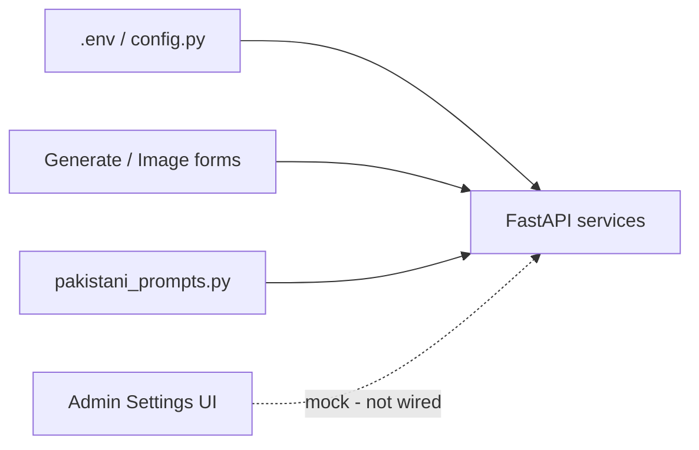

# PakVoice AI — Customization Guide

What you can customize today, where it lives, and what is UI-only (not wired).

---

## 1. Backend `.env` / `config.py` (real — restart required)

Copy [`backend/.env.example`](../backend/.env.example) to `backend/.env`. Settings are loaded by [`backend/config.py`](../backend/config.py).

| Area | Variables |
| --- | --- |
| App | `APP_NAME`, `VERSION`, `DEBUG` |
| AI text | `OPENAI_API_KEY`, `OPENAI_MODEL`, `AI_TEMPERATURE`, `AI_MAX_TOKENS` |
| Content agent | `AGENT_MODEL`, `AGENT_MAX_STEPS`, `AGENT_REQUIRE_VALIDATION`, `AGENT_MAX_REFINE_ITERATIONS` |
| Web search | `WEB_SEARCH_ENABLED`, `WEB_SEARCH_MAX_RESULTS`, `WEB_SCRAPE_MAX_CHARS`, `SERPER_API_KEY`, `TAVILY_API_KEY` |
| Images | `IMAGE_MODEL`, `IMAGE_SIZE`, `IMAGE_QUALITY`, `IMAGE_STORAGE_DIR` |
| STT | `WHISPER_MODEL`, `WHISPER_MAX_FILE_MB` |
| RAG | `EMBEDDING_MODEL`, `EMBEDDING_DIMENSIONS`, `RAG_TOP_K`, `COLLECTION_NAME`, `CHROMA_PERSIST_DIR` |
| WhatsApp | `WHATSAPP_ENABLED`, `WHATSAPP_PHONE_NUMBER_ID`, `WHATSAPP_DISPLAY_NUMBER`, `WHATSAPP_ACCESS_TOKEN`, `WHATSAPP_VERIFY_TOKEN`, `WHATSAPP_APP_SECRET`, `WHATSAPP_MAX_MESSAGES_PER_MINUTE`, `WHATSAPP_LINK_CODE_TTL_MINUTES`, `WHATSAPP_API_VERSION` |
| Auth | `SECRET_KEY`, `ALGORITHM`, `ACCESS_TOKEN_EXPIRE_MINUTES`, Google OAuth vars |
| Limits | `RATE_LIMIT`, `RATE_LIMIT_GENERATE`, `RATE_LIMIT_IMAGE`, `RATE_LIMIT_STT`, `RATE_LIMIT_AGENT`, `MAX_FILE_SIZE_MB`, `ALLOWED_EXTENSIONS` |
| Storage | `SUPABASE_DB_URL`, `SUPABASE_URL`, `SUPABASE_SERVICE_KEY`, bucket names, `SIGNED_URL_TTL_SECONDS` |
| CORS / URLs | `ALLOWED_ORIGINS`, `FRONTEND_URL` |

**Notes**

- Leave `SUPABASE_DB_URL` empty to use local JSON under `backend/data/` (dev only).
- Without Supabase Storage credentials, uploads and images stay on local disk.
- Changing `EMBEDDING_MODEL` / `EMBEDDING_DIMENSIONS` requires recreating vector tables and re-uploading documents.
- `DEBUG=true` enables demo seeding and Google OAuth auto-login — keep `false` in production.

### Frontend env

| Variable | Where | Purpose |
| --- | --- | --- |
| `NEXT_PUBLIC_API_URL` | `frontend/.env.local` | Backend base URL (default `http://localhost:8000`) |
| `NEXT_PUBLIC_APP_URL` | `frontend/.env.local` | App origin for redirects / deep links |

---

## 2. Content generation (per-request)

UI: [`frontend/app/client/generate/page.tsx`](../frontend/app/client/generate/page.tsx)  
Types: [`frontend/types/index.ts`](../frontend/types/index.ts)  
Prompts: [`backend/prompts/pakistani_prompts.py`](../backend/prompts/pakistani_prompts.py)

### Form options

| Control | Values |
| --- | --- |
| Content type | Social Media Post, Blog Article, Product Description, Email Marketing, Press Release, Website Content, Advertisement Copy |
| Industry | Textile, IT & Software, Agriculture, Healthcare, Education, Retail, Manufacturing, Food & Beverage, Construction, Transportation, Banking & Finance, Real Estate |
| City | Karachi, Lahore, Islamabad, Rawalpindi, Faisalabad, Multan, Peshawar, Quetta, Sialkot, Gujranwala (mapped in `CITY_CONTEXT_MAP`) |
| Language | `english`, `urdu`, `roman-urdu` |
| Tone | Professional, Casual, Persuasive, Informative, Friendly |
| Length | short, medium, long |
| Free text | Business name, description, key message, target audience |
| RAG | Toggle + select knowledge-base documents |
| Voice (STT) | Language override via `AudioRecorder` |
| Refine | Free-text refinement instruction after generation |

### Adding new cities / tones / industries

1. Extend enums / unions in frontend `types/index.ts` and backend content models.
2. Add context strings in `CITY_CONTEXT_MAP` / `INDUSTRY_CONTEXT_MAP` / tone maps in `pakistani_prompts.py`.
3. Update generate-page dropdowns (and WhatsApp menus if needed).

---

## 3. Images, knowledge base, profile

### Images

- UI: [`frontend/app/client/image-generator/page.tsx`](../frontend/app/client/image-generator/page.tsx)
- Types: `social_media` \| `thumbnail` + brief (≤2000 chars)
- Model/size/quality: `.env` (`IMAGE_*`)
- Brand-extraction prompts: hardcoded in [`backend/services/image_service.py`](../backend/services/image_service.py)

### Knowledge base

- Client: [`frontend/app/client/knowledge-base/page.tsx`](../frontend/app/client/knowledge-base/page.tsx)
- Admin: [`frontend/app/admin/knowledge-base/page.tsx`](../frontend/app/admin/knowledge-base/page.tsx)
- Upload metadata: title, category (`Products` / `Services` / `Company Info` / `Market Research`), tags
- Allowed file types / size: `ALLOWED_EXTENSIONS`, `MAX_FILE_SIZE_MB`
- Uploaded docs power RAG when generation uses the knowledge base

### Profile

- UI: [`frontend/app/client/profile/page.tsx`](../frontend/app/client/profile/page.tsx)
- Editable: name, city, industry
- WhatsApp account linking: [`frontend/components/shared/WhatsAppConnect.tsx`](../frontend/components/shared/WhatsAppConnect.tsx)
- API model: `ProfileUpdate` in [`backend/models/user.py`](../backend/models/user.py)
- Registration also collects city / industry: [`frontend/app/(auth)/register/page.tsx`](../frontend/app/(auth)/register/page.tsx)

---

## 4. WhatsApp bot

Config gate: `WHATSAPP_ENABLED` + Meta credentials in `.env` (see [DEPLOYMENT.md](./DEPLOYMENT.md)).

Bot logic: [`backend/services/whatsapp_bot.py`](../backend/services/whatsapp_bot.py)

| Customizable | How |
| --- | --- |
| On / off | `WHATSAPP_ENABLED` |
| Display number in UI | `WHATSAPP_DISPLAY_NUMBER` |
| Per-phone rate limit | `WHATSAPP_MAX_MESSAGES_PER_MINUTE` |
| Link-code TTL | `WHATSAPP_LINK_CODE_TTL_MINUTES` |
| Session prefs | Interactive menus: language, tone, content type |
| Capabilities | Generate content, image from content, history, KB upload, settings |
| Reply / menu copy | Edit strings and menu rows in `whatsapp_bot.py` |

Users link their WhatsApp number from the client profile (link code flow).

---

## 4b. Client Content Agent

A **client-only** tool-calling agent that turns a free-text goal into a planned,
validated campaign pack. The LLM is the writer; the system does orchestration,
retrieval, deterministic validation, persistence, and auth scoping.

UI: [`frontend/app/client/agent/page.tsx`](../frontend/app/client/agent/page.tsx)  
Backend: [`backend/services/agent_service.py`](../backend/services/agent_service.py)

| Knob | Default | Purpose |
| --- | --- | --- |
| `AGENT_MODEL` | blank → falls back to `OPENAI_MODEL` | Model driving the planner / tool loop |
| `AGENT_MAX_STEPS` | `12` | Max tool-calling iterations per run |
| `AGENT_REQUIRE_VALIDATION` | `true` | Run deterministic validators before returning the pack |
| `AGENT_MAX_REFINE_ITERATIONS` | `3` | Max quality-check refine/re-search cycles per run |
| `WEB_SEARCH_ENABLED` | `true` | Toggle the agent's live search / scrape tools |
| `WEB_SEARCH_MAX_RESULTS` | `5` | Results returned per `web_search` call |
| `WEB_SCRAPE_MAX_CHARS` | `6000` | Truncation for `scrape_page` page text |
| `SERPER_API_KEY` / `TAVILY_API_KEY` | blank | Optional paid search providers (blank → free DuckDuckGo) |
| `RATE_LIMIT_AGENT` | `8/minute` | Per-IP rate limit on `/api/agent/chat` |

Tools (all scoped to the calling `user_id`): `get_profile`, `list_kb_docs`,
`search_kb`, `generate_content`, `refine_content`, `generate_image`,
`suggest_hashtags`, `make_variants`, `plan_calendar`, `list_history`,
`save_history`, `run_quality_check`, `web_search`, `scrape_page`.

The `web_search` / `scrape_page` tools give the agent live internet access. They
default to DuckDuckGo (no API key) and fall back to a paid provider only when
`SERPER_API_KEY` or `TAVILY_API_KEY` is set. Toggle them per-request with the
"Live search" checkbox in the UI (`use_web_search`), or globally with
`WEB_SEARCH_ENABLED`. After drafting, the agent re-runs the deterministic quality
checks and loops (refine or re-search) until they pass or the refinement budget
(`AGENT_MAX_REFINE_ITERATIONS`) is exhausted.

Only `role == "client"` accounts may call the agent; admin accounts are rejected
with 403. There is deliberately **no** cost/token/spend telemetry anywhere in the
agent. See [AGENT_ARCHITECTURE.md](./AGENT_ARCHITECTURE.md) for the full event
contract and validator list.

---

## 5. Theme / branding (partial)

| Piece | Location | Status |
| --- | --- | --- |
| Theme tokens (green / red / blue) | [`frontend/app/globals.css`](../frontend/app/globals.css) `[data-theme]` | CSS ready |
| Theme toggle + `localStorage` (`pk-theme`) | `ThemeToggle`, `uiStore` | Works, but… |
| Forced green wrapper | `client/layout.tsx`, `admin/layout.tsx`, landing `page.tsx`, `AuthShell` | Overrides page chrome to green |
| Landing copy / FAQ | [`frontend/app/page.tsx`](../frontend/app/page.tsx), `LandingNav`, `FaqAccordion` | Static in code |
| Auth branding | [`frontend/components/shared/AuthShell.tsx`](../frontend/components/shared/AuthShell.tsx) | Static |

To brand the product: edit landing/auth copy and CSS variables; remove or relax forced `data-theme="green"` wrappers if you want the toggle to affect chrome.

---

## 6. Admin Settings / API Keys — mock only

These UIs look configurable but **do not persist** to the backend:

- [`frontend/app/admin/settings/page.tsx`](../frontend/app/admin/settings/page.tsx) — notifications, 2FA, session timeout, default language, currency, theme, compact mode, SMTP
- [`frontend/app/admin/api-keys/page.tsx`](../frontend/app/admin/api-keys/page.tsx) — provider enable/disable and pasted keys

**Real API keys and AI settings come only from `backend/.env`.** Wiring admin Settings would need new persistence APIs and secret handling (not implemented).

Admin knowledge base / users / content / analytics pages that call the API are real; only Settings and API Keys are placeholders.

---

## Quick reference — where to change what

| Goal | Edit |
| --- | --- |
| Switch GPT model / creativity | `.env` → `OPENAI_MODEL`, `AI_TEMPERATURE`, `AI_MAX_TOKENS` |
| Image quality / size | `.env` → `IMAGE_*` |
| How Pakistani context is written | `backend/prompts/pakistani_prompts.py` |
| New dropdown options | Frontend types + generate page + prompt maps |
| Enable WhatsApp | `.env` WhatsApp block + Meta app (see DEPLOYMENT.md) |
| Bot wording / menus | `backend/services/whatsapp_bot.py` |
| Landing marketing text | `frontend/app/page.tsx` |
| Colors | `frontend/app/globals.css` theme blocks |
| Rate limits / upload caps | `.env` → `RATE_LIMIT*`, `MAX_FILE_SIZE_MB` |

---

## Typical follow-up work (not built yet)

1. Expand prompts / cities / tones in `pakistani_prompts.py` + generate form.
2. Wire admin Settings for real theme / language / API key persistence.
3. Unlock forced theme wrappers and polish landing branding.
4. Customize WhatsApp reply copy and menu flow in `whatsapp_bot.py`.
